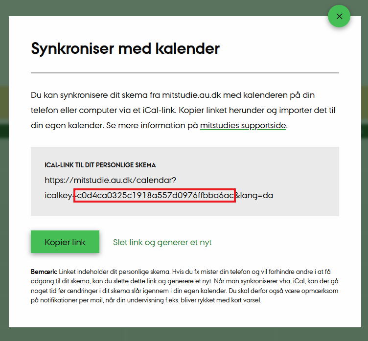
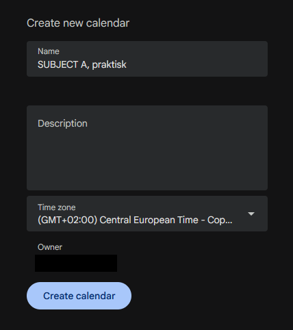
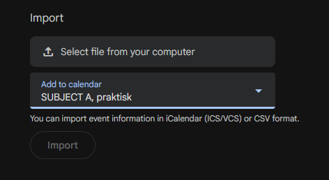

# AU Calendar (Separation) Middleware
This is a simple (albeit poorly and overengineered) Java port of OMikkel's Python implementation of this middleware. It's used to separate between your sessions and classes at AU. There are a few differences, however. With the exception of connecting to AU, this port does everything locally -- OMikkel had a few endpoints connecting to several sites, including his own.

[Make sure to check out OMikkel's version, if you're interested.](https://github.com/OMikkel/au-calendar-middleware)

Currently, there is no support for coloring for, say, Google Calendar. So, the goal is to separate the lessons and lesson types into several calendars, such that color-coding the categories is easier on Google Calendar. Color-coding might work with an attribute "COLOR" in other ICS readers. This software is specifically for separation, because Google Calendar doesn't read the "COLOR" attribute.

While it *is* possible to do this manually, it would probably take an eternity.

### Java Version

This was compiled using this compiler; ~~however I'm sure a great range of versions work. This is because most of the methods are trivial.~~
I've come to find out through a little testing, that it's necessary to have at least the version shown below.

```
java 24.0.1 2025-04-15
Java(TM) SE Runtime Environment (build 24.0.1+9-30)
Java HotSpot(TM) 64-Bit Server VM (build 24.0.1+9-30, mixed mode, sharing)
```
Originally, I had the user check out `java.com`, but it seems that the download from Oracle, and their Java development kit is necessary.

[Please download the latest JDK here.](https://www.oracle.com/java/technologies/downloads/)

This is because, without the JDK, you won't have the `javac` command, which is necessary for compiling this program. See more about that in the guide.

# Guide

### ***NOTE :*** This is a guide for almost absolute beginners. I'm assuming that people of all faculties could practically be using this software.


Copy the repo, either by downloading the zip, or (if you have git installed) 

* `git clone https://github.com/Dr-Dressing/au-calendar`

to whichever folder you're currently in.

Find your key on `mitstudie.au.dk`, and pass it as an argument, when running the executable.

This is an example of what a key looks like.




## Compiling the software

It should be a given, but you must have installed Java to compile. You can download the JDK on [https://www.oracle.com/java/technologies/downloads](https://www.oracle.com/java/technologies/downloads).

If you have Make, you can compile with `make` inside of the `/src/` folder. If not, navigate to your directory through a terminal with `cd ~/{wherever you've downloaded it}/src`.

Then, compile using `javac ./*.java`. 

* (This is where having the JDK is necessary, otherwise you get compatibility issues trying to run the program)

You'll see a lot of new classes in the `src` folder. One corresponding to each of the `.java` files.

## Running the software

Make sure, in a terminal, that you're still in the directory, where you've compiled, i.e. the `/src/` folder. You can now run `java Main <YOUR KEY>`, and the program will do the separation.


E.g. sample input `java Main c0d4ca0325c1918a557d0976ffbba6ac`

It will attempt to download your calendar, and separate them.

Here's the (paraphrased) output

```
Found 8 different categories.


SUMMARY:Course A, Praktisk
SUMMARY:Course A, Forelæsning
SUMMARY:Course A, Holdundervisning
SUMMARY:Course B, Forelæsning
SUMMARY:Course B, Holdundervisning
SUMMARY:Course B, Praktisk
SUMMARY:Course C, Forelæsning
SUMMARY:Course C, Holdundervisning


Created calendarCategory1.ics for category SUMMARY:Course A, Praktisk
Created calendarCategory2.ics for category SUMMARY:Course A, Forelæsning
Created calendarCategory8.ics for category SUMMARY:Course A, Holdundervisning
Created calendarCategory3.ics for category SUMMARY:Course B, Forelæsning       
Created calendarCategory5.ics for category SUMMARY:Course B, Holdundervisning  
Created calendarCategory7.ics for category SUMMARY:Course B, Praktisk
Created calendarCategory4.ics for category SUMMARY:Course C, Holdundervisning
Created calendarCategory6.ics for category SUMMARY:Course C, Forelæsning
```

You'll see your own calendar in the `src` folder, and those 8 generated (you may have a different number) subjects or courses calendars, and their respective types.  

The importing to Google Calendar is trivial. I'm assuming people know how to use the calendar, because a guide is provided by AU. The difference is, instead of using a link, you'll import from a file. I recommend creating a new calendar for each, otherwise they'll merge on to a designated calendar (E.g. the one with your name), and you'll be back to square one.



Followed by importing your `SUBJECT A, praktisk` into that very calendar.



Do this for every subject, in this order, and you should be allowed to change colors.


## 17/08/2025

I've noticed that some of the comments I've made are out of date. I'll fix them at some point.
